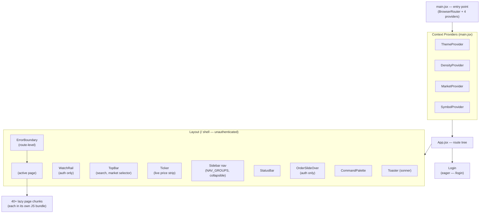
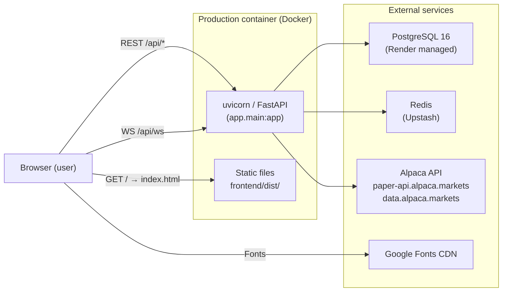

# Architecture

> Project: lodestar
> Type: react-app
> Skill: react-frontend-analysis

Lodestar is a quantitative trading platform — a single-page React dashboard that covers market data browsing (public) and live/paper trading, strategy management, and backtesting (authenticated). The frontend is a JavaScript (not TypeScript) Vite SPA that communicates with a FastAPI backend over REST + a single persistent WebSocket.

## Stack

| Concern | Value | Source |
|---|---|---|
| Framework | React 18.3 | `frontend/package.json` |
| Language | JavaScript (JSX) — no TypeScript | `frontend/src/*.jsx` |
| Build tool | Vite 5.3 | `frontend/package.json` |
| Router | React Router DOM 6.26 | `frontend/package.json` |
| State management | Zustand 5.0 (single store) | `frontend/package.json` |
| HTTP client | Native `fetch` via custom wrapper | `frontend/src/lib/api.js` |
| Real-time | Native WebSocket (`/api/ws`) | `frontend/src/lib/api.js:181` |
| Styling | Tailwind CSS 3.4 + PostCSS + CSS variables | `frontend/package.json`, `frontend/tailwind.config.js` |
| Charts | Recharts 2.12, lightweight-charts 5.2 | `frontend/package.json` |
| Icons | Lucide React 0.400 | `frontend/package.json` |
| Toasts | Sonner 2.0 (wrapped in `lib/toast.js`) | `frontend/package.json` |
| Fonts | Inter, JetBrains Mono, Sora (Google Fonts CDN) | `frontend/index.html:22` |

## Build Config

| Setting | Value | Source |
|---|---|---|
| Dev port | 3000 | `frontend/vite.config.js:8` |
| API proxy | `/api` → `http://localhost:8000` | `frontend/vite.config.js:9` |
| Build output | `frontend/dist/` | `frontend/vite.config.js:14` |
| Sourcemaps | `false` | `frontend/vite.config.js:15` |
| Manual chunks | `vendor-react`, `vendor-charts`, `vendor-lwcharts`, `vendor-icons` | `frontend/vite.config.js:17-23` |
| Base path | `/` (Vite default — not explicitly set) | `frontend/vite.config.js` |
| TS config | None — JS project | — |
| Env prefix | None set (Vite default `VITE_`) — no VITE_ vars in use | — |

## State and Data Layer Summary

All global trading state lives in a single Zustand store (`lib/store.js`). There is no query library (no React Query or SWR); all fetching is done through a hand-rolled `fetch` wrapper in `lib/api.js`. The WebSocket drives invalidation — on every WS event the store re-fetches the relevant REST slice rather than applying the message directly (server is authoritative). Four React contexts handle pure UI preferences (theme, density, active market, active symbol) and are kept out of the Zustand store because they don't depend on server data.

## Component Architecture

## System Context

