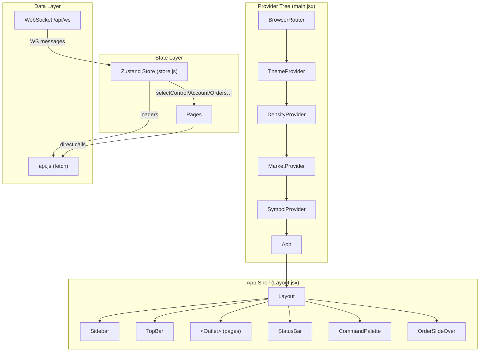
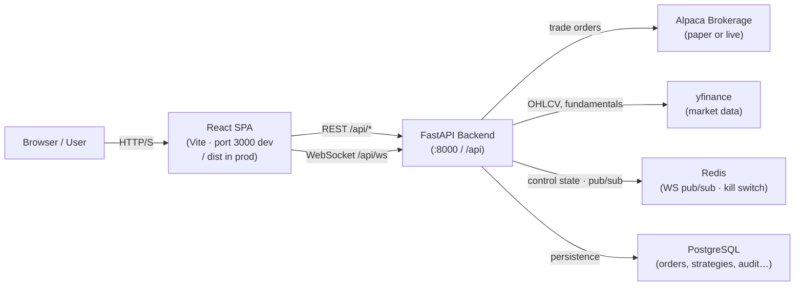

# 01 — Architecture

## Stack

| Concern | Value | Source |
|---|---|---|
| Framework | React 18.3.0 | `frontend/package.json:14` |
| Language | JavaScript (ES modules, `.jsx`) | `frontend/package.json:5` |
| Build tool | Vite 5.3.0 | `frontend/package.json:26` |
| Router | React Router DOM 6.26.0 | `frontend/package.json:16` |
| Global state | Zustand 5.0.13 | `frontend/package.json:19` |
| Local/UI state | React Context (4 providers) | `frontend/src/main.jsx:6-9` |
| Styling | Tailwind CSS 3.4.19 + CSS custom properties | `frontend/package.json:25`, `frontend/src/index.css` |
| Charts (OHLCV) | Lightweight Charts 5.2.0 | `frontend/package.json:12` |
| Charts (analytics) | Recharts 2.12.0 | `frontend/package.json:17` |
| Icons | Lucide React 0.400.0 | `frontend/package.json:13` |
| Toasts | Sonner 2.0.7 | `frontend/package.json:18` |
| HTTP client | Native `fetch` (no axios) | `frontend/src/lib/api.js:26` |
| Real-time | Native `WebSocket` with auto-reconnect | `frontend/src/lib/api.js:182` |
| PostCSS | Autoprefixer 10.5.0 | `frontend/package.json:22` |

## Build Configuration

| Setting | Value | Source |
|---|---|---|
| Dev server port | 3000 | `frontend/vite.config.js:7` |
| API proxy | `/api` → `http://localhost:8000` | `frontend/vite.config.js:9` |
| Output directory | `dist` | `frontend/vite.config.js:13` |
| Source maps (prod) | Disabled | `frontend/vite.config.js:14` |
| Manual chunk: `vendor-react` | `react`, `react-dom`, `react-router-dom` | `frontend/vite.config.js:18` |
| Manual chunk: `vendor-charts` | `recharts` | `frontend/vite.config.js:19` |
| Manual chunk: `vendor-lwcharts` | `lightweight-charts` | `frontend/vite.config.js:20` |
| Manual chunk: `vendor-icons` | `lucide-react` | `frontend/vite.config.js:21` |
| Route chunks | One chunk per lazy page (27 routes) | `frontend/src/App.jsx:10-44` |
| Env prefix | None — env vars accessed via Vite default | `frontend/vite.config.js` |
| Base path | `/` (default) | `frontend/vite.config.js` |

## State & Data-Layer Summary

There are two tiers of state:

**Zustand store** (`frontend/src/lib/store.js`) is the single source of truth for live trading data: control flags, health, account, positions, orders, alerts, strategies, backtests, and WebSocket connection state. Loaders are idempotent and coalesce concurrent calls. The WS message router triggers REST invalidations rather than writing server data directly into state.

**React Context** provides four ambient, non-trading concerns:
- `ThemeContext` — dark/light toggle, persisted to `localStorage.quant_theme_v1`
- `DensityContext` — compact/cozy/comfortable row density, `localStorage.quant_density_v1`
- `MarketContext` — US/India market selector, `localStorage.quant_market_v1`
- `SymbolContext` — active symbol + recents (max 12), `localStorage.quant_active_symbol_v1`

## Diagrams

### Component Architecture

### System Context

