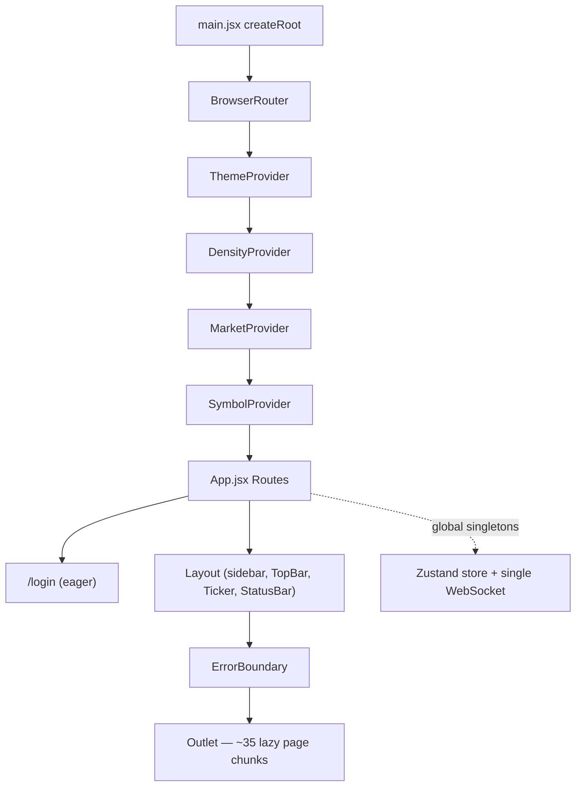
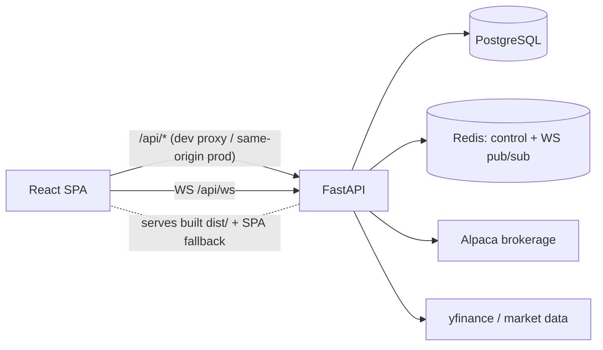

# 01 — Architecture

Target: `frontend/` — Lodestar trading dashboard (client-rendered React SPA).

## Stack

| Concern | Value | Source |
|---|---|---|
| Framework | React `^18.3.0` | [frontend/package.json](../../frontend/package.json#L13-L14) |
| Language | JavaScript (ESM, `.jsx`) — ⚠️ no TypeScript | [frontend/package.json](../../frontend/package.json#L4) |
| Build tool | Vite `^5.3.0` + `@vitejs/plugin-react` | [frontend/package.json](../../frontend/package.json#L21-L22) |
| Router | `react-router-dom` `^6.26.0` | [frontend/package.json](../../frontend/package.json#L15) |
| State | `zustand` `^5.0.13` + React Context | [frontend/package.json](../../frontend/package.json#L18) |
| Styling | Tailwind `^3.4.19` + PostCSS/autoprefixer | [frontend/package.json](../../frontend/package.json#L24-L26) |
| Charts | `recharts`, `lightweight-charts` | [frontend/package.json](../../frontend/package.json#L11-L17) |
| Icons / toasts | `lucide-react`, `sonner` | [frontend/package.json](../../frontend/package.json#L12-L16) |
| TypeScript | N/A — no `tsconfig.json` | — |
| Module Federation | N/A — no federation plugin | — |

## Build config

| Setting | Value | Source |
|---|---|---|
| Dev port | 3000 | [vite.config.js](../../frontend/vite.config.js#L6-L7) |
| Dev proxy | `/api → http://localhost:8000` | [vite.config.js](../../frontend/vite.config.js#L8-L10) |
| Base path | `/` (default) | [vite.config.js](../../frontend/vite.config.js) |
| Output dir | `dist/`, `sourcemap: false` | [vite.config.js](../../frontend/vite.config.js#L12-L14) |
| Aliases | None (relative imports) | [vite.config.js](../../frontend/vite.config.js) |
| Env prefix | None used (`VITE_*` absent) | ⚠️ inferred |
| Chunking | `vendor-react`, `vendor-charts`, `vendor-lwcharts`, `vendor-icons` | [vite.config.js](../../frontend/vite.config.js#L16-L22) |

## State & data layers

| Layer | Holds | Mechanism | Source |
|---|---|---|---|
| Zustand store | Live trading state (control, health, account, positions, orders, alerts, strategies, backtests) | Coalesced loaders + WS invalidation | [lib/store.js](../../frontend/src/lib/store.js) |
| Context (client/UI) | theme, density, market (US/IN), active symbol + recents | Context + localStorage | [ThemeContext.jsx](../../frontend/src/lib/ThemeContext.jsx), [MarketContext.jsx](../../frontend/src/lib/MarketContext.jsx), [SymbolContext.jsx](../../frontend/src/lib/SymbolContext.jsx) |
| Page-local | Market-data reads (snapshots, news, options, fundamentals, tape) | `useEffect` + `useState`, uncached | `src/pages/*` |
| HTTP boundary | All `/api` calls | `fetch` wrapper | [lib/api.js](../../frontend/src/lib/api.js#L16-L46) |
| Real-time | Single WebSocket `/api/ws` → store invalidation | — | [api.js](../../frontend/src/lib/api.js#L195-L218), [store.js](../../frontend/src/lib/store.js#L107-L147) |

## Component architecture

## System context

In production FastAPI serves `frontend/dist` as static files with an SPA fallback (single origin); the static mount is added last so it cannot shadow `/api/*`. Source: [CLAUDE.md](../../CLAUDE.md).
