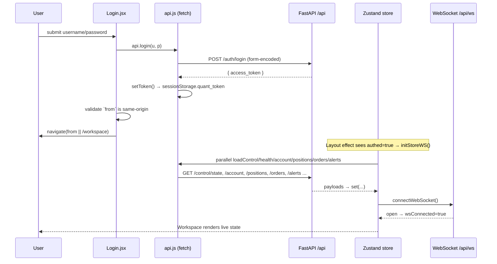
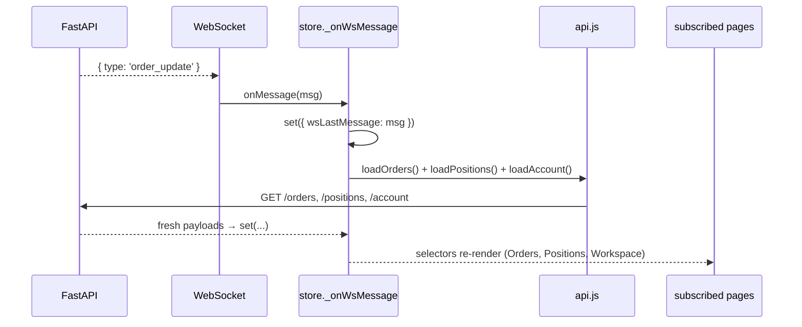
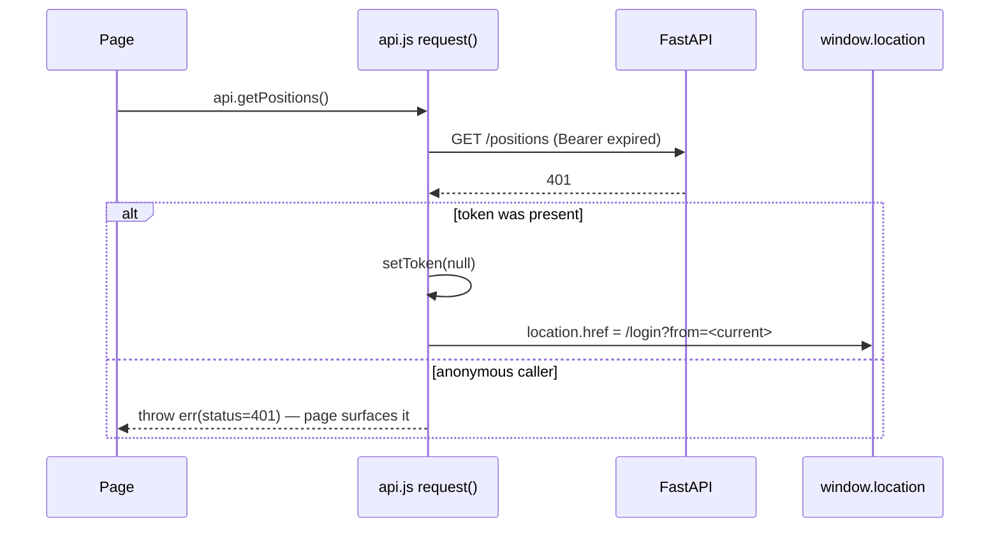
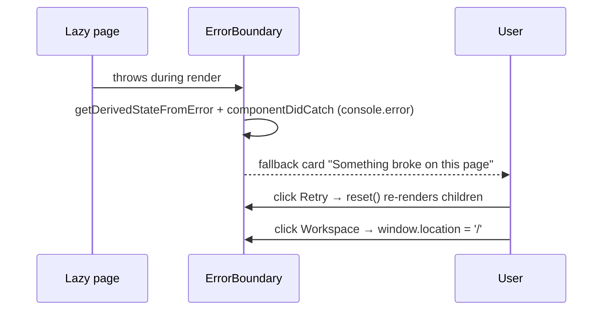

# 06 — Interactions

This document traces the main runtime interaction sequences. Minimum two diagrams: a happy path and an error/recovery path.

## Page lifecycle (general)

1. Router matches a path → `<Suspense>` shows `RouteFallback` skeleton while the lazy chunk downloads.
2. Page mounts → reads context (`useSymbol`, `useMarket`) and/or store selectors.
3. Page either subscribes to the Zustand store (live-trading pages) or fires `api.*` in a `useEffect` (market-data pages) and holds results in local state.
4. Errors in render bubble to the route-level `ErrorBoundary` wrapping `<Outlet/>`.

## Happy path — login → workspace load

## Real-time update — order fill pushed over WS

WS messages trigger **invalidation/reload**, never direct writes — the REST response stays canonical ([store.js](../../frontend/src/lib/store.js#L107-L147)).

## Error / recovery — session expiry mid-use

See [api.js](../../frontend/src/lib/api.js#L28-L40).

## Error / recovery — page render crash

Only the route content crashes; the sidebar/topbar/ticker chrome stays alive because `ErrorBoundary` wraps just the `<Outlet/>` ([Layout.jsx](../../frontend/src/components/Layout.jsx#L360-L362), [ErrorBoundary.jsx](../../frontend/src/components/ErrorBoundary.jsx)).

## Navigation & hotkeys

`Layout` installs global hotkeys (`installHotkeys()`) and registers `g m`, `g s`, `g c`, `g h`, `g a`, `g p`, `g o`, `g t` navigation shortcuts plus `/` to focus search and `shift+?` to open shortcut help. See [Layout.jsx](../../frontend/src/components/Layout.jsx#L137-L149). The mobile drawer auto-closes on route change ([Layout.jsx](../../frontend/src/components/Layout.jsx#L103-L104)).

## Market switch interaction

Selecting a market in `MarketContext.setMarket` persists the choice, updates the currency formatter, and dispatches `market:change`; the store listener re-pulls account + positions ([MarketContext.jsx](../../frontend/src/lib/MarketContext.jsx#L45-L54), [store.js](../../frontend/src/lib/store.js#L186-L191)).
