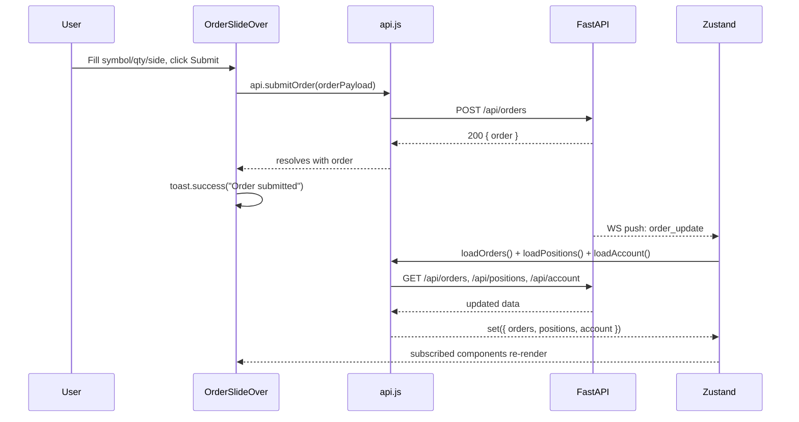
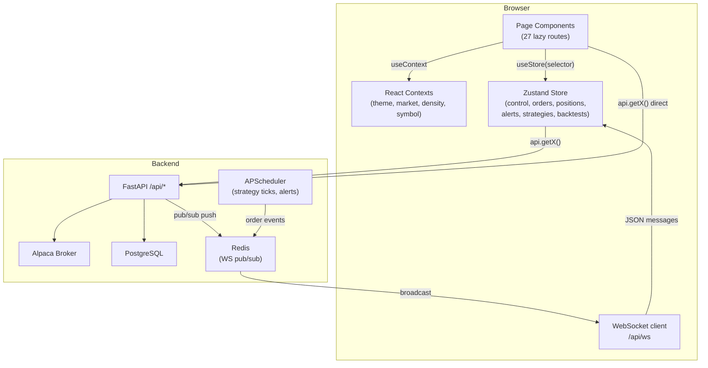
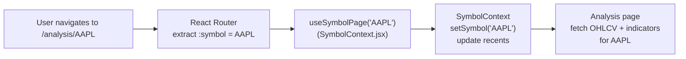

# 06 — Runtime Flows

## Page Lifecycle

Most pages follow this pattern on mount:

1. On first render, call one or more `useStore.getState().loadX()` actions (for store-backed data) or local `useEffect` fetches (for page-specific REST calls).
2. The loader is idempotent — concurrent calls coalesce via an in-flight map; if the data is already fetching, the new call joins the existing promise. `frontend/src/lib/store.js:23-30`
3. The page renders a skeleton (`<SkeletonRows>`) while data loads, then the populated view.
4. For public research pages (Analysis, Fundamentals, Options, etc.) the active symbol comes from `SymbolContext` — when the user changes the symbol, the page re-fetches.
5. Private pages (Workspace, Trade, Strategies) subscribe to Zustand slices. WS events invalidate the relevant slice, triggering a REST refetch and a re-render.

Mutations (order submit, strategy create, backtest trigger) are fire-and-forget REST calls: the page `await`s the response, shows a toast on success or error, and then either relies on the next WS event to refresh state or calls the loader directly.

## Diagrams

### Happy-Path Sequence: Submit an Order



### Error / Recovery Sequence: Risk-Rejected Order

```mermaid
sequenceDiagram
    participant User
    participant OrderSlideOver
    participant api.js
    participant FastAPI

    User->>OrderSlideOver: Submit order (exceeds position size limit)
    OrderSlideOver->>api.js: api.submitOrder(orderPayload)
    api.js->>FastAPI: POST /api/orders
    FastAPI-->>api.js: 422 { detail: { reason: "Position size exceeds 5% limit" } }
    api.js->>api.js: extract detail.reason, throw Error
    api.js-->>OrderSlideOver: throws
    OrderSlideOver->>OrderSlideOver: toast.error("Position size exceeds 5% limit")
    Note over OrderSlideOver: Form stays open; user can adjust and retry
```

### Main End-to-End Data Flow



### Routing & Symbol Resolution Flow



## Mutation Flow

All mutations are **non-optimistic**. The UI waits for the server response before updating state. State updates arrive via WS events (fast path) or the 30 s safety-refresh interval (fallback). There is no local-first write or rollback logic.

Exception: `api.exportOrdersCsv()` and `api.exportBacktestCsv()` use `window.open()` directly rather than `fetch`, bypassing the request wrapper entirely. `frontend/src/lib/api.js:105-106`
