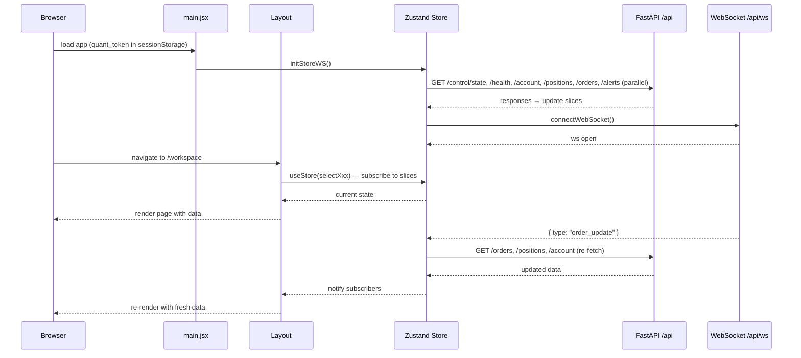
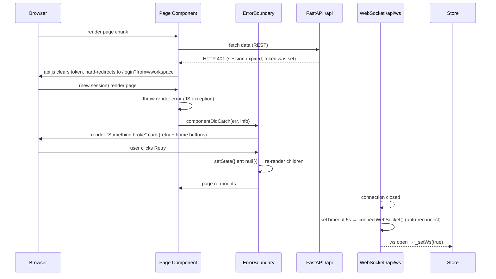
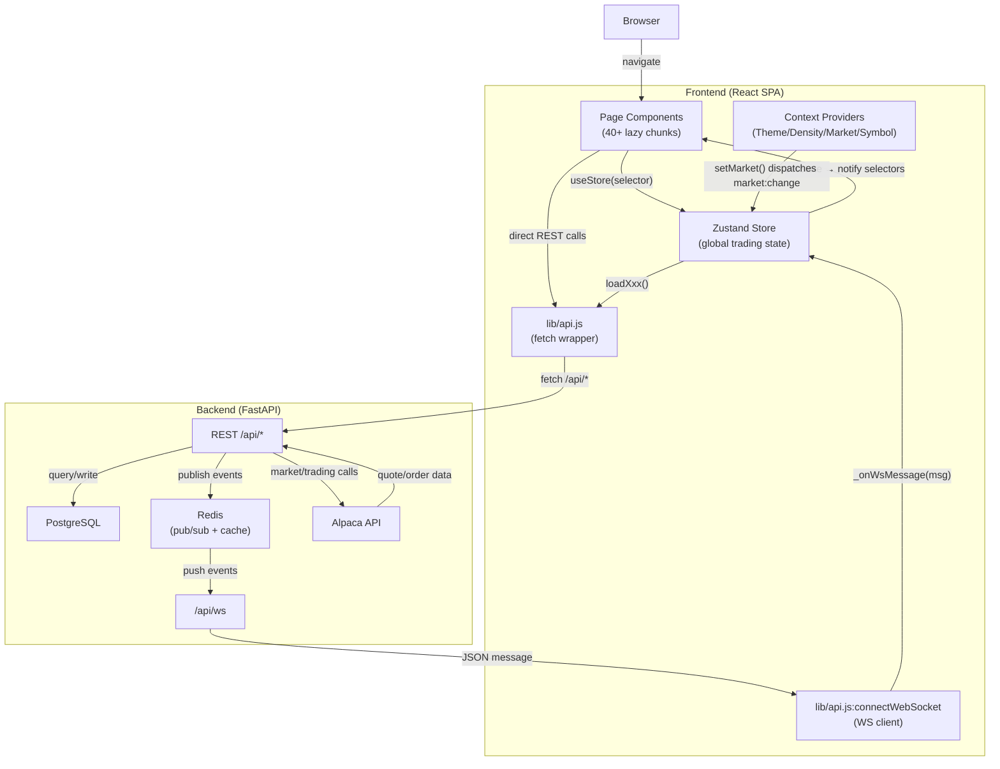

# Runtime Flows

> Project: lodestar
> Type: react-app
> Skill: react-frontend-analysis

## Page Lifecycle

**Authenticated user navigating to a private page (e.g. `/workspace`):**

1. User loads app or clicks a nav link.
2. React Router evaluates the route; the `Private` wrapper renders `RequireAuth`.
3. `RequireAuth` reads `sessionStorage.quant_token` — token present, so it renders children.
4. `Layout` has already booted (it checks auth on every navigation and calls `initStoreWS()` — idempotent via `bootstrapped` flag).
5. `initStoreWS()` fires six parallel REST fetches (`loadControl`, `loadHealth`, `loadAccount`, `loadPositions`, `loadOrders`, `loadAlerts`) and opens the WebSocket.
6. The page chunk (`Workspace.jsx`) is lazy-loaded; `<Suspense>` shows `RouteFallback` (skeleton rows) until the chunk and its initial data are ready.
7. The page component mounts and calls `useStore(selectXxx)` for the slices it needs. Zustand notifies only the subscribers of those specific selectors.
8. The WebSocket starts delivering server events; each event type calls the relevant `loadXxx()` loader, which re-fetches from REST and updates the store. The page re-renders with fresh data.
9. A 30 s `setInterval` backstop re-fetches all slices even if no WS event arrives (`store.js:161-170`).

**Anonymous user navigating to a public page (e.g. `/stocks`):**

1. No token in sessionStorage — `initStoreWS()` is **not** called.
2. Layout renders with `authed = false`; auth-only sidebar items show a lock icon; `WatchRail` and `OrderSlideOver` are hidden.
3. The page mounts and fetches directly from REST (no Zustand store involvement for public market data).

## Happy-Path Sequence: Authenticated Session

## Error / Recovery Sequence

## Main End-to-End Data Flow

## Mutation Flow

All mutations (place order, create strategy, run backtest, etc.) are fire-and-wait: the page calls `api.submitOrder()` (or equivalent), waits for the REST response, then the WS delivers a `order_update` / `backtest_completed` event that invalidates the relevant store slice. There is **no optimistic update** pattern — the UI does not update before server confirmation.

The one exception is toast notifications on `backtest_completed`: the WS message includes `return_pct` and `trades`, which are shown immediately in a success toast (`store.js:124-128`) alongside the store re-fetch.
