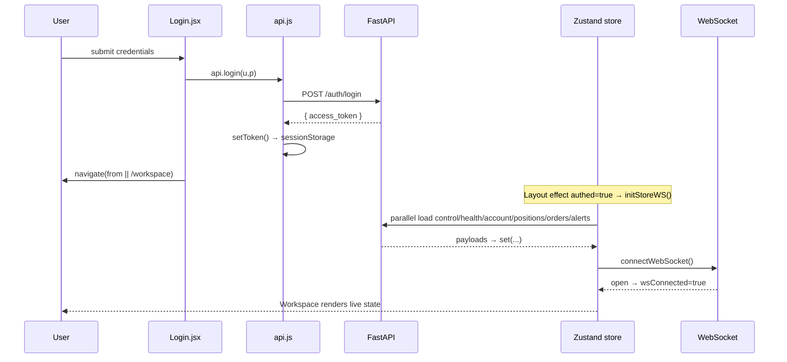
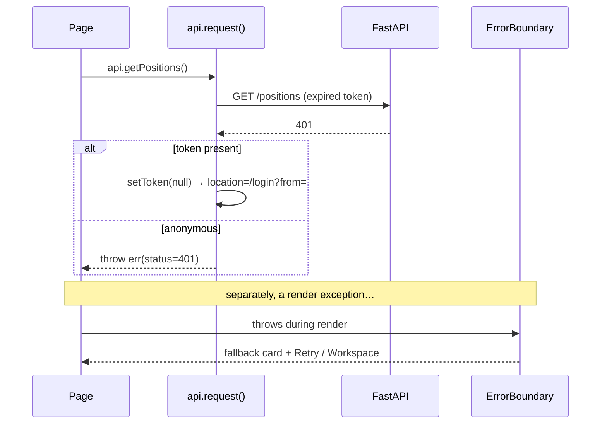
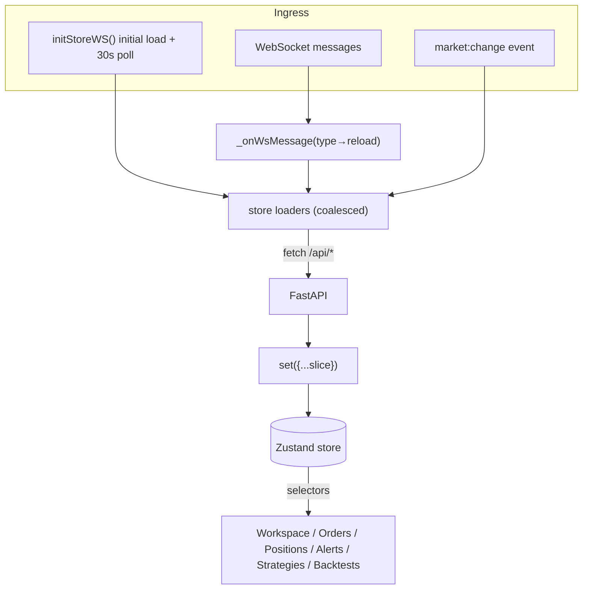
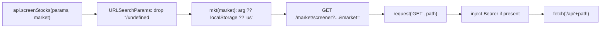

# 06 — Runtime Flows

## Page lifecycle

| Phase | Behavior | Source |
|---|---|---|
| Route match | `<Suspense>` shows `RouteFallback` skeleton while lazy chunk loads | [App.jsx](../../frontend/src/App.jsx#L59-L84) |
| Mount | Page reads context (`useSymbol`/`useMarket`) and/or store selectors | various |
| Data | Live pages subscribe to store; market pages fire `api.*` in `useEffect` → local state | [store.js](../../frontend/src/lib/store.js), `src/pages/*` |
| Error | Render exceptions bubble to `ErrorBoundary` around `<Outlet/>` | [Layout.jsx](../../frontend/src/components/Layout.jsx#L360-L362) |

Mutations are **non-optimistic** — UI reflects state only after server confirmation / WS reload ([store.js](../../frontend/src/lib/store.js#L133-L142)).

## Happy-path sequence — login → workspace

## Error/recovery sequence — 401 & render crash

Sources: [api.js](../../frontend/src/lib/api.js#L28-L40), [ErrorBoundary.jsx](../../frontend/src/components/ErrorBoundary.jsx).

## Main data flow — live trading state

WS messages invalidate/reload; REST stays canonical ([store.js](../../frontend/src/lib/store.js#L107-L147)).

## Routing / transform — request construction

Source: [api.js](../../frontend/src/lib/api.js#L9-L13).
