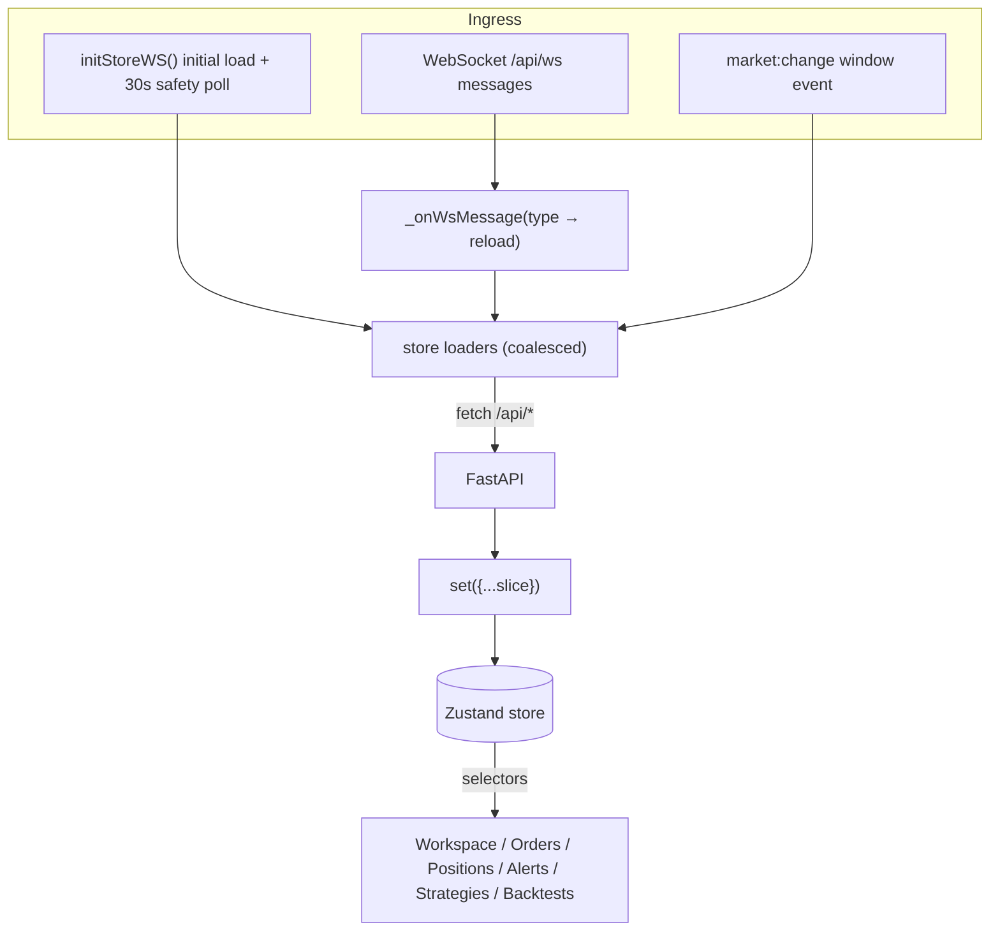
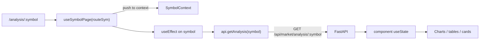
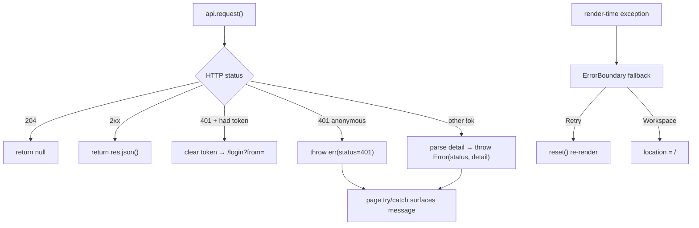
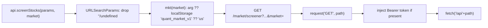
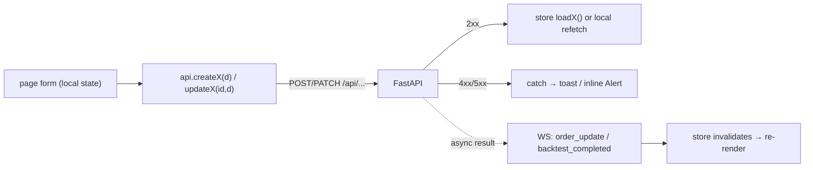

# 07 — Data Flow

Minimum three diagrams: main end-to-end flow, error/recovery flow, and a routing/transformation detail.

## 1. Main data flow — live trading state

Two ingress paths feed one store; pages are pure subscribers.

Key properties:
- **Coalescing:** concurrent loader calls share one in-flight promise ([store.js](../../frontend/src/lib/store.js#L22-L30)).
- **Authoritative server:** WS only invalidates; the REST reload writes state ([store.js](../../frontend/src/lib/store.js#L107-L147)).
- **Backstop poll:** a 30s interval re-pulls everything in case a WS event was missed while the tab was hidden ([store.js](../../frontend/src/lib/store.js#L173-L182)).

## 2. Market-data page flow (non-cached reads)

Unlike live-trading slices, research/market pages keep results in **local component state**, not the global store. Active symbol and market scope come from context ([SymbolContext.jsx](../../frontend/src/lib/SymbolContext.jsx#L82-L96), [MarketContext.jsx](../../frontend/src/lib/MarketContext.jsx)).

## 3. Error / recovery flow

See [api.js](../../frontend/src/lib/api.js#L28-L46) and [ErrorBoundary.jsx](../../frontend/src/components/ErrorBoundary.jsx).

## 4. Routing / transformation detail — request construction

The `mkt()` helper ([api.js](../../frontend/src/lib/api.js#L9-L13)) lets US-scoped endpoints inherit the active market without every caller threading it explicitly.

## Create/update (mutation) flow

Mutations are **not optimistic** — the UI reflects state after the server confirms, and long-running work (backtests, orders) finalizes via WS-driven store reloads ([store.js](../../frontend/src/lib/store.js#L133-L142)).
