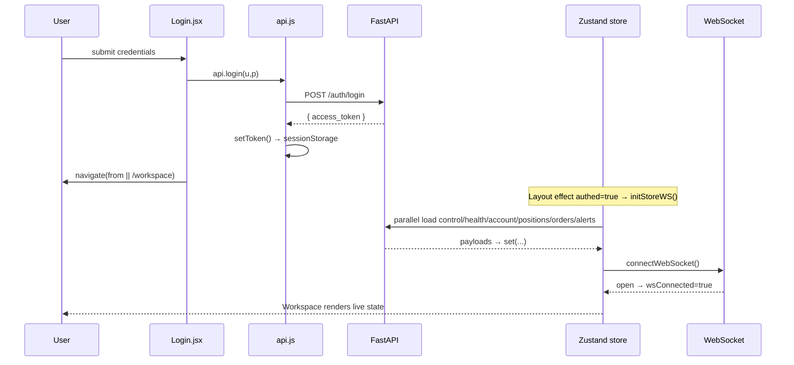
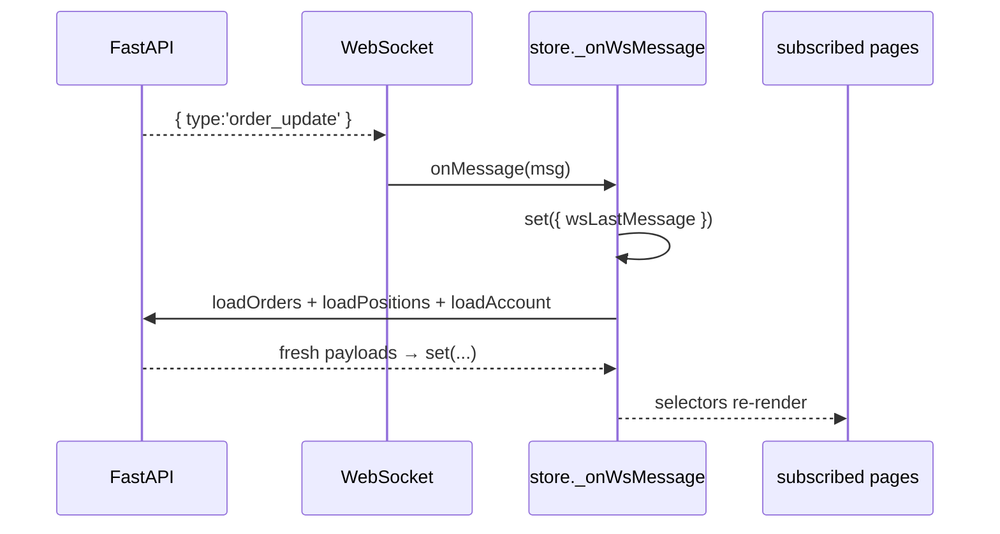
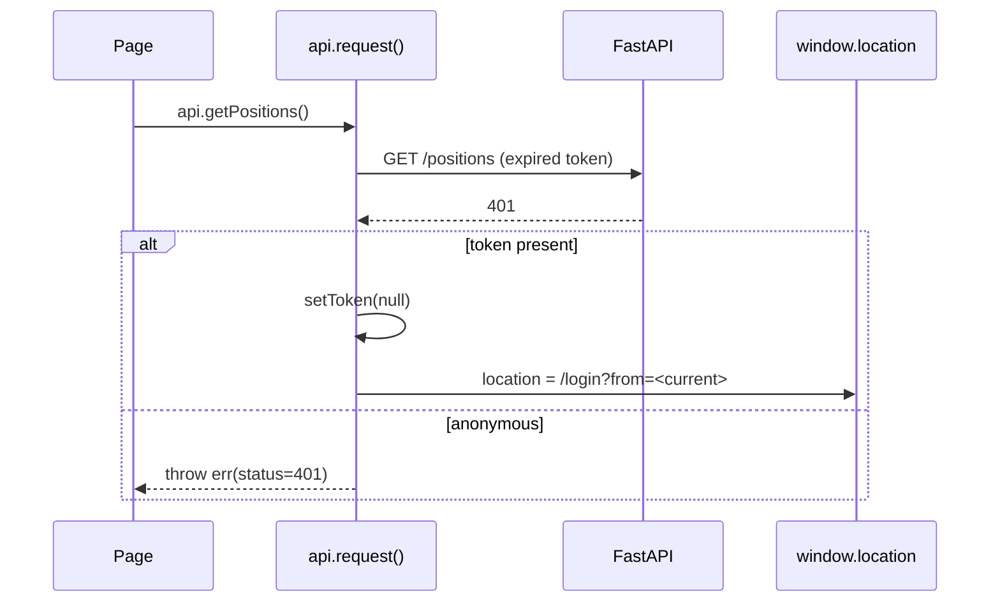
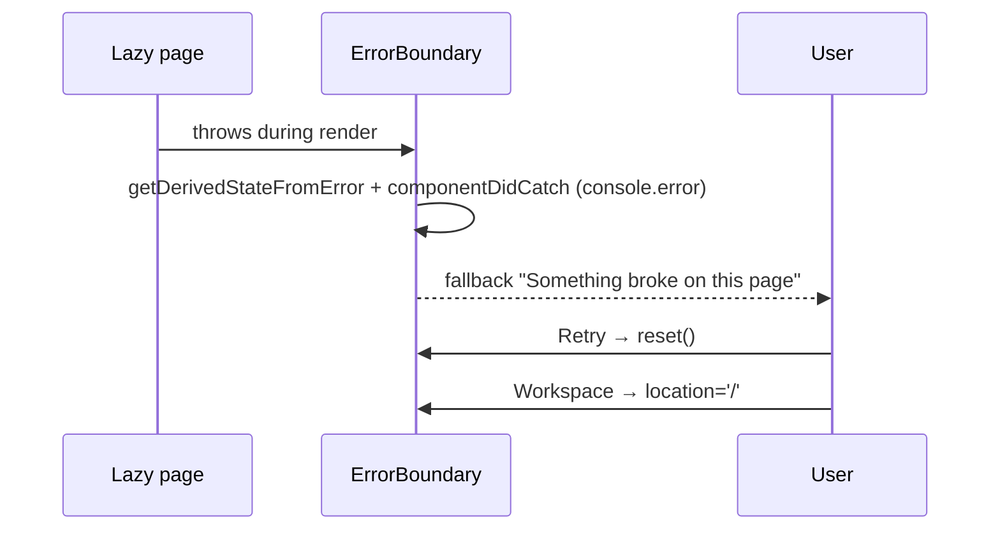

# 06 — Interactions

## Page lifecycle

| Phase | Behavior | Source |
|---|---|---|
| Route match | `<Suspense>` shows `RouteFallback` skeleton while lazy chunk loads | [App.jsx](../../frontend/src/App.jsx#L59-L84) |
| Mount | Page reads context (`useSymbol`/`useMarket`) and/or store selectors | various |
| Data | Live pages subscribe to store; market pages fire `api.*` in `useEffect` → local state | [store.js](../../frontend/src/lib/store.js), `src/pages/*` |
| Error | Render exceptions bubble to `ErrorBoundary` around `<Outlet/>` | [Layout.jsx](../../frontend/src/components/Layout.jsx#L360-L362) |

## Happy path — login → workspace

## Real-time update — order fill

WS messages invalidate/reload; REST stays canonical ([store.js](../../frontend/src/lib/store.js#L107-L147)).

## Error / recovery — session expiry (401)

Source: [api.js](../../frontend/src/lib/api.js#L28-L40).

## Error / recovery — render crash

Only the routed page crashes; chrome stays alive ([ErrorBoundary.jsx](../../frontend/src/components/ErrorBoundary.jsx), [Layout.jsx](../../frontend/src/components/Layout.jsx#L360-L362)).

## Other interactions

| Interaction | Flow | Source |
|---|---|---|
| Navigation hotkeys | `g m/s/c/h/a/p/o/t`, `/` focus search, `shift+?` help | [Layout.jsx](../../frontend/src/components/Layout.jsx#L137-L149) |
| Market switch | `setMarket` → persist + currency + `market:change` → store re-pulls account/positions | [MarketContext.jsx](../../frontend/src/lib/MarketContext.jsx#L45-L54) |
| Mobile drawer | auto-closes on route change; body scroll locked when open | [Layout.jsx](../../frontend/src/components/Layout.jsx#L103-L113) |
