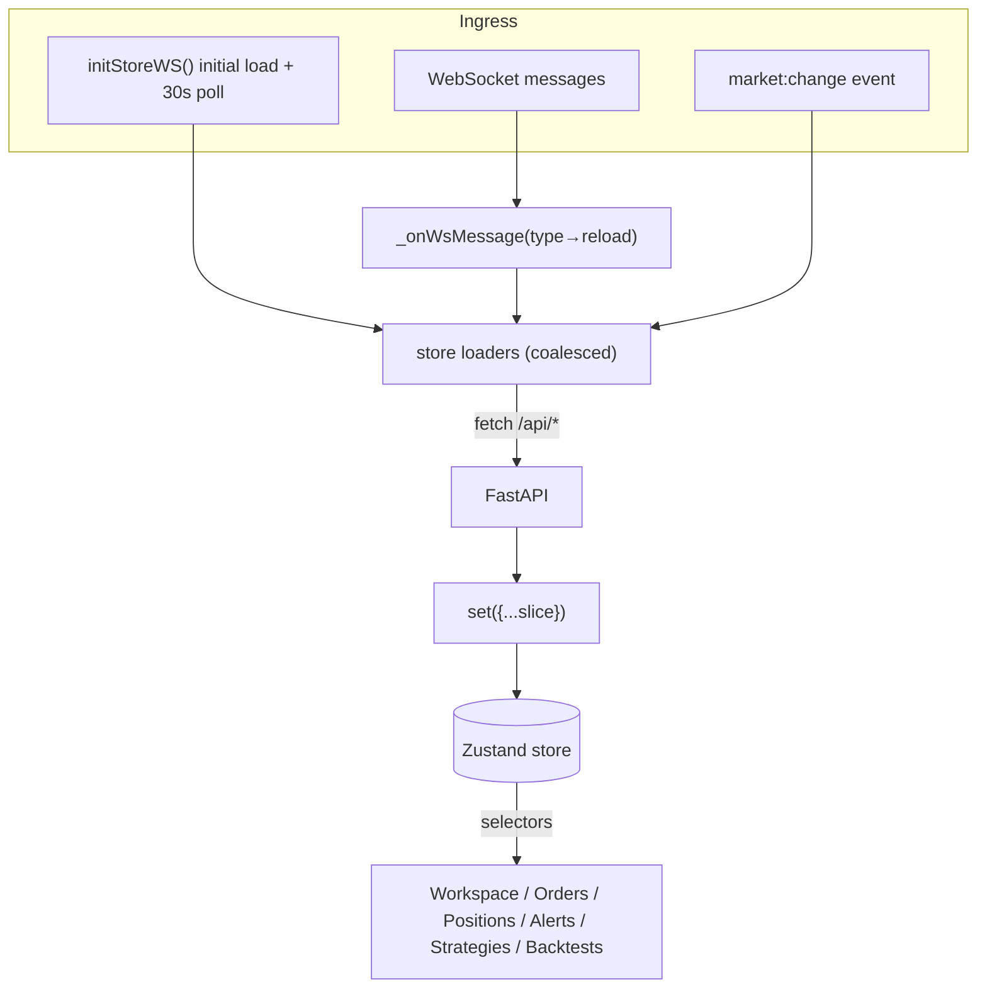
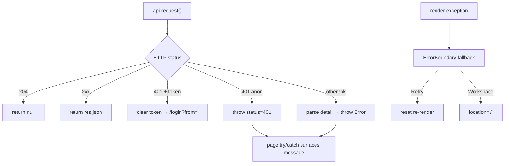
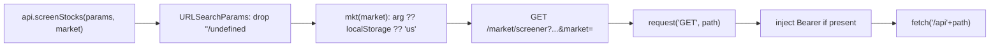
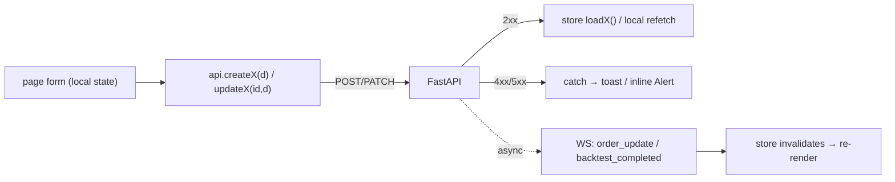

# 07 — Data Flow

## 1. Main data flow — live trading state

Properties: coalesced loaders ([store.js](../../frontend/src/lib/store.js#L22-L30)); WS invalidates only ([store.js](../../frontend/src/lib/store.js#L107-L147)); 30s safety poll backstop ([store.js](../../frontend/src/lib/store.js#L173-L182)).

## 2. Error / recovery flow

Source: [api.js](../../frontend/src/lib/api.js#L28-L46), [ErrorBoundary.jsx](../../frontend/src/components/ErrorBoundary.jsx).

## 3. Routing / transformation — request construction

`mkt()` lets US-scoped endpoints inherit active market ([api.js](../../frontend/src/lib/api.js#L9-L13)).

## Page-type flows

| Flow | Sequence | Source |
|---|---|---|
| Live-trading page | mount → store selector subscribe → (WS/poll invalidates → reload) → re-render | [store.js](../../frontend/src/lib/store.js) |
| Market-data page | route `:symbol` → `useSymbolPage` → `useEffect` → `api.getX` → local `useState` → render | [SymbolContext.jsx](../../frontend/src/lib/SymbolContext.jsx#L82-L96) |
| Mutation | form local state → `api.createX/updateX` → 2xx reload (store/local) / 4xx toast/Alert; long work finalizes via WS | [store.js](../../frontend/src/lib/store.js#L130-L142) |

## Mutation flow (non-optimistic)

Optimistic updates: none — UI reflects state only after server confirmation ([store.js](../../frontend/src/lib/store.js#L133-L142)).
