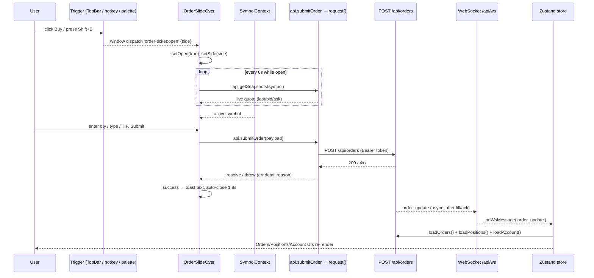

# Feature Trace — Order Placement (the global Order Ticket)

## Summary

A user places a buy/sell order through a global slide-in "Order Ticket" that can be opened from anywhere (TopBar button, keyboard shortcut, command palette, context menu, symbol header). It submits to `POST /api/orders`; the resulting fill propagates back through the WebSocket as an `order_update`, which the store turns into a re-fetch of orders, positions, and account — so the rest of the UI updates without the ticket touching it directly.

## Trigger

The ticket is a single always-mounted component, `OrderSlideOver`, rendered inside `Layout` ([frontend/src/components/OrderSlideOver.jsx](../../frontend/src/components/OrderSlideOver.jsx#L11)). It opens by listening for a global `order-ticket:open` CustomEvent (and `Shift+B` / `Shift+S`) — [OrderSlideOver.jsx](../../frontend/src/components/OrderSlideOver.jsx#L28-L48).

Dispatch sites (all fire the same event with `{ detail: { side } }`):

| Source | Location |
|---|---|
| TopBar Buy/Sell buttons | [TopBar.jsx](../../frontend/src/components/TopBar.jsx#L226-L233) |
| Command palette | [CommandPalette.jsx](../../frontend/src/components/CommandPalette.jsx#L182-L183) |
| Right-click context menu | [ContextMenu.jsx](../../frontend/src/components/ui/ContextMenu.jsx#L80-L82) |
| Symbol header Buy/Sell | [SymbolHeader.jsx](../../frontend/src/components/SymbolHeader.jsx#L115-L116) |
| Orders empty-state CTA | [Orders.jsx](../../frontend/src/pages/Orders.jsx#L48) |
| Keyboard `Shift+B`/`Shift+S` | [OrderSlideOver.jsx](../../frontend/src/components/OrderSlideOver.jsx#L37-L40) |

The order's **symbol** is not passed in the event — it comes from the global `SymbolContext` (`useSymbol()`), so the ticket always trades the app's active ticker ([OrderSlideOver.jsx](../../frontend/src/components/OrderSlideOver.jsx#L13)).

> Other entry points exist that **bypass** the ticket and call `api.submitOrder` directly: the guided [CoachTrade.jsx](../../frontend/src/components/CoachTrade.jsx#L103) and the [Workspace.jsx](../../frontend/src/pages/Workspace.jsx#L255) quick-trade panel. They build the same payload shape.

## Flow



### Step-by-step

1. **Open** — a trigger dispatches `order-ticket:open`; `OrderSlideOver` sets `open` + `side` ([OrderSlideOver.jsx](../../frontend/src/components/OrderSlideOver.jsx#L30-L34)).
2. **Live quote** — while open, it polls `api.getSnapshots(symbol)` every 8s for last/bid/ask and computes change% ([OrderSlideOver.jsx](../../frontend/src/components/OrderSlideOver.jsx#L51-L70)).
3. **Validate + build payload** — `submit()` rejects empty/≤0 qty, then assembles `{ symbol, side, qty, order_type, time_in_force, extended_hours }`, conditionally adding `limit_price` / `stop_price` for limit/stop/stop_limit types ([OrderSlideOver.jsx](../../frontend/src/components/OrderSlideOver.jsx#L71-L86)).
4. **Submit** — `api.submitOrder(payload)` → `request('POST', '/orders', body)`, which attaches the bearer token and JSON-encodes ([api.js](../../frontend/src/lib/api.js#L76), [api.js](../../frontend/src/lib/api.js#L16-L26)).
5. **Success** — shows `"BUY 10 AAPL placed"`, clears inputs, auto-closes after 1.8s ([OrderSlideOver.jsx](../../frontend/src/components/OrderSlideOver.jsx#L89-L92)).
6. **Propagation** — the ticket does **not** update orders/positions itself. The backend later emits `order_update` over the WS; `_onWsMessage` re-runs `loadOrders()`, `loadPositions()`, `loadAccount()` ([store.js](../../frontend/src/lib/store.js#L102-L106)). The 30s safety poll is the fallback if that message is missed.

## Data

**Request** (`POST /api/orders`):
```json
{ "symbol": "AAPL", "side": "buy", "qty": 10, "order_type": "market",
  "time_in_force": "day", "extended_hours": false,
  "limit_price": 0, "stop_price": 0 }
```
`limit_price` present only for `limit`/`stop_limit`; `stop_price` only for `stop`/`stop_limit` ([OrderSlideOver.jsx](../../frontend/src/components/OrderSlideOver.jsx#L84-L85)).

**Where state lands:** nowhere locally on success — canonical order state arrives via WS → `store.orders` ([store.js](../../frontend/src/lib/store.js#L57-L64)). The ticket holds only ephemeral form + quote state.

**Cache/invalidation:** WS `order_update` is the invalidation trigger; loaders de-dupe via `coalesce()` ([store.js](../../frontend/src/lib/store.js#L22-L30)).

## Dependencies to bring along

- `SymbolContext` (active symbol) — [SymbolContext.jsx](../../frontend/src/lib/SymbolContext.jsx)
- `api.submitOrder` + `api.getSnapshots` + the `request()` wrapper — [api.js](../../frontend/src/lib/api.js#L76)
- The Zustand store's `order_update` handling + loaders — [store.js](../../frontend/src/lib/store.js#L100-L106)
- Formatting helpers `fmt` / `activeCurrency` — `components/ui/format.js`
- Backend: `POST /api/orders`, `GET /api/market/snapshots`, and the WS `order_update` message.

## Edge cases & states

| State | Behavior | Source |
|---|---|---|
| Empty/≤0 qty | inline `"Enter quantity"`, no request | [OrderSlideOver.jsx](../../frontend/src/components/OrderSlideOver.jsx#L73) |
| Submitting | `submitting` disables the action | [OrderSlideOver.jsx](../../frontend/src/components/OrderSlideOver.jsx#L74-L94) |
| Server reject (risk gate, etc.) | shows `err.detail.detail.reason` from the backend | [OrderSlideOver.jsx](../../frontend/src/components/OrderSlideOver.jsx#L93-L96) |
| 401 (expired session) | `request()` clears token, hard-redirects to `/login?from=` | [api.js](../../frontend/src/lib/api.js#L27-L37) |
| No live quote | cost estimate falls back to limit price or 0 | [OrderSlideOver.jsx](../../frontend/src/components/OrderSlideOver.jsx#L102) |
| Close | Escape or backdrop click sets `open=false` | [OrderSlideOver.jsx](../../frontend/src/components/OrderSlideOver.jsx#L38) |

## To replicate

1. Mount one always-on `OrderSlideOver`-style component in the layout.
2. Open it via a global event so any surface can trigger it without prop drilling.
3. Source the symbol from a global context, not the event payload.
4. Build the typed payload with conditional limit/stop fields; submit through the shared API client (inherits auth + 401 handling).
5. **Do not** mutate orders/positions on success — let the WS `order_update` invalidate the store so all consumers update from the authoritative server state.
