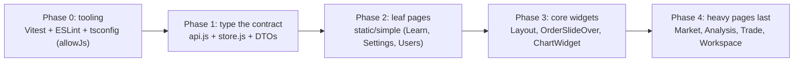

# Lodestar Frontend — Migration / Modernization Plan

The most common and highest-value modernization for this codebase is **JavaScript → TypeScript**, plus adding a **test harness** and a **server-state library**. This plan is target-agnostic where possible and calls out the JS→TS path explicitly because it's the dominant risk-reducer here.

## 1. Likely targets

| Move | Why it applies here | Priority |
|---|---|---|
| **JS → TypeScript** | 60 `.jsx` files, 19k LOC, **zero types**; DTOs are reconstructed from usage | High |
| **Add server-state lib (React Query)** | server state is a hand-rolled store + manual `coalesce`/30s poll ([store.js](../../frontend/src/lib/store.js#L22-L96)) | High |
| **Add test harness (Vitest + RTL)** | 0 tests today | High |
| **Add ESLint/Prettier** | no lint config present | Medium |
| Framework move (Next.js/SSR) | **not recommended** — it's a private dashboard; SSR adds cost with little benefit | Low |

The build tool is already modern (Vite 5) and React is current (18.3) — **no CRA/webpack/React-version migration needed**, which removes the usual biggest migration cost.

## 2. Preservation inventory (what must not break)

### API contract (the spec a rewrite must preserve)
All endpoints are centralized in one file — [frontend/src/lib/api.js](../../frontend/src/lib/api.js) — which makes the contract easy to freeze. Surface:

| Group | Representative endpoints | Source |
|---|---|---|
| Auth | `POST /auth/login` (form-encoded), `GET /auth/me` | [api.js](../../frontend/src/lib/api.js#L49-L54) |
| Control | `GET /control/state`, `POST /control/{kill,resume,liquidate}`, strategy pause/resume | [api.js](../../frontend/src/lib/api.js#L57-L63) |
| Account | `GET /account`, `GET /positions` (market-scoped) | [api.js](../../frontend/src/lib/api.js#L66-L67) |
| Strategies | `GET/POST/PATCH/DELETE /strategies`, `GET /strategies/available` | [api.js](../../frontend/src/lib/api.js#L69-L73) |
| Orders | `GET /orders`, `POST /orders`, `POST /orders/{id}/sync` | [api.js](../../frontend/src/lib/api.js#L75-L77) |
| Backtests / Optimizer | CRUD + trades + CSV export | [api.js](../../frontend/src/lib/api.js#L79-L84) |
| Market data | ohlcv, snapshots, movers, screener, news, options, fundamentals, earnings, tape, crypto, sentiment, analysis | [api.js](../../frontend/src/lib/api.js#L86-L171) |
| Analytics | equity-curve, portfolio-risk, strategy-pnl | [api.js](../../frontend/src/lib/api.js#L87-L89) |
| Alerts | system alerts + price alerts CRUD | [api.js](../../frontend/src/lib/api.js#L91-L99) |
| Users (admin) | list/create/delete/role | [api.js](../../frontend/src/lib/api.js#L173-L177) |
| Realtime | `WS /api/ws`; message types `order_update`, `position_closed`, `alert`, `price_alert_triggered`, `control_update`, `strategy_update`, `strategy_signal`, `backtest_completed`, `trade` | [store.js](../../frontend/src/lib/store.js#L100-L145) |

This endpoint list **is the migration spec** — a missed endpoint or WS message type is a production regression. Generating OpenAPI types from the FastAPI backend would let TS consume the contract directly.

### Routes & URLs to preserve
The full route table is in [frontend/src/App.jsx](../../frontend/src/App.jsx#L84-L165) (~38 paths incl. param routes like `/tape/:symbol`, `/analysis/:symbol`, `/backtests/:id`, `/optimizer/:id`). `/dashboard` redirects to `/workspace`. These are deep-linkable and must keep resolving.

### Business logic to preserve
- Auth gate semantics: token-presence guard + 401→`/login?from=` ([App.jsx](../../frontend/src/App.jsx#L46-L58), [api.js](../../frontend/src/lib/api.js#L27-L37)).
- Market scoping (US⇄India suffix `.NS`, currency) ([MarketContext.jsx](../../frontend/src/lib/MarketContext.jsx#L17-L24)).
- Order-ticket payload shape (`order_type`, `time_in_force`, conditional `limit_price`/`stop_price`) ([OrderSlideOver.jsx](../../frontend/src/components/OrderSlideOver.jsx#L72-L86)).
- WS-as-invalidation-bus behavior ([store.js](../../frontend/src/lib/store.js#L100-L145)).

## 3. Module inventory with effort

| Module | LOC | Migration type | Risk | Effort |
|---|---|---|---|---|
| [lib/api.js](../../frontend/src/lib/api.js) | ~180 | refactor → typed client (or generated) | Med (it's the contract) | M |
| [lib/store.js](../../frontend/src/lib/store.js) | ~170 | refactor → React Query or typed Zustand | Med | M |
| `components/ChartWidget.jsx` | 1172 | refactor (split + type) | High (largest, charting) | L |
| `pages/Analysis.jsx`, `Market.jsx` | 862 each | refactor | Med | L each |
| `pages/Learn.jsx` + `lib/learn*.js` | 770+ | lift-and-shift (static content) | Low | S |
| 4 Contexts (`*Context.jsx`) | small | lift-and-shift + type | Low | S |
| Remaining ~30 pages | ~200–650 each | refactor per page | Low–Med | M (bulk) |

No modules are obviously dead from the route table — every lazy import in [App.jsx](../../frontend/src/App.jsx#L11-L43) maps to a `<Route>`. Confirm with an import-graph check before marking anything "drop."

## 4. Dependency risk

- **Low.** 8 runtime deps, all current and maintained (React 18.3, react-router 6, zustand 5, recharts 2, lightweight-charts 5, sonner 2, lucide). No deprecated packages (no CRA, no Enzyme, no moment).
- Adding TS/Vitest/ESLint are **additive** dev-dep changes with no runtime conflict.
- React Query (if adopted) coexists cleanly with Zustand during incremental migration.

## 5. Strategy & sequence

**Strangler / incremental, not big-bang** — the app is medium-sized but has zero tests, so each step needs manual verification; small batches reduce blast radius.

1. **Phase 0 — Foundation.** Add `tsconfig.json` with `allowJs`, Vitest + Testing Library, ESLint (react-hooks). Tests first on `api.js`/store so later phases have a safety net.
2. **Phase 1 — Type the contract.** Convert `api.js` and `store.js`; define DTOs (ideally generated from the backend OpenAPI). This is the load-bearing step — everything downstream consumes these types.
3. **Phase 2 — Leaf pages.** Static/simple screens (Learn, Settings, Users) to build momentum.
4. **Phase 3 — Shared widgets.** Layout, OrderSlideOver, ChartWidget (split the 1172-LOC chart first).
5. **Phase 4 — Heavy pages.** Market/Analysis/Trade/Workspace last, with tests landing alongside.

## 6. Risks & unknowns

- **No tests = no safety net.** Phase 0 must precede everything; otherwise regressions are invisible.
- **DTO shapes are inferred from usage,** not declared — the backend (`app/core/schemas.py`) is the source of truth; reconcile against it when typing.
- **WS message contract** is implicit in the `_onWsMessage` switch ([store.js](../../frontend/src/lib/store.js#L100-L145)); confirm the full set server-side before typing it.
- **Hidden coupling via direct `localStorage` reads** in three files (market key) must be centralized during Phase 1 or types will drift.
