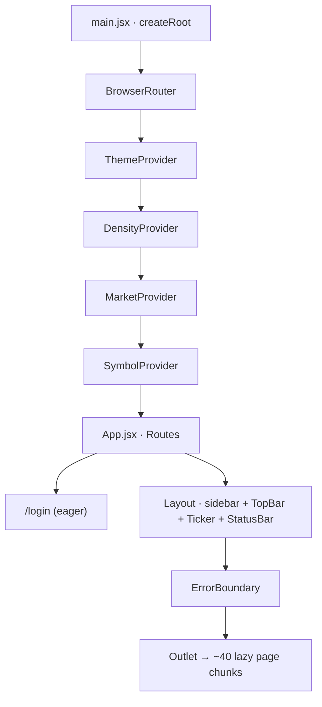

# Lodestar Frontend — Architecture Guide

## 1. What this app is

Lodestar's frontend is the operator dashboard for an autonomous quant-trading platform. Anonymous visitors get full market data, research, and charts; signed-in users additionally get trading, strategies, backtests, positions, risk, and admin. It is a client-rendered React 18 SPA served as static files by the same FastAPI app that exposes the `/api`.

## 2. Stack at a glance

| Concern | Choice |
|---|---|
| Framework / build | React 18 + Vite 5 (SPA, no SSR) — [frontend/vite.config.js](../../frontend/vite.config.js#L4-L25) |
| Language | JavaScript (`.jsx`), ESM — no TypeScript |
| Routing | `react-router-dom` v6, JSX route tree — [frontend/src/App.jsx](../../frontend/src/App.jsx#L84-L165) |
| Server state | Zustand store fed by a `fetch` wrapper — [frontend/src/lib/store.js](../../frontend/src/lib/store.js#L31-L96) |
| UI state | 4 React Contexts (Theme, Density, Market, Symbol) — [frontend/src/main.jsx](../../frontend/src/main.jsx#L17-L27) |
| Realtime | one WebSocket → store invalidation — [frontend/src/lib/api.js](../../frontend/src/lib/api.js#L182-L203) |
| Styling | Tailwind CSS 3 |
| Charts | recharts + lightweight-charts |
| Toasts | sonner |

## 3. Run it locally

```bash
cd frontend
npm install
npm run dev      # Vite dev server on :3000, proxies /api → :8000
npm run build    # → frontend/dist (served by FastAPI in prod)
npm run preview  # preview the production build
```

[frontend/package.json](../../frontend/package.json#L5-L9) defines all three scripts. The dev proxy is in [frontend/vite.config.js](../../frontend/vite.config.js#L6-L11) — the backend (FastAPI on :8000, see root [CLAUDE.md](../../CLAUDE.md)) must be running for anything beyond static rendering. No frontend `.env` file or `VITE_*` variables exist; the API base is the hardcoded relative path `/api` ([frontend/src/lib/api.js](../../frontend/src/lib/api.js#L2)).

## 4. Big picture

### Provider stack



Source: [frontend/src/main.jsx](../../frontend/src/main.jsx#L17-L27), [frontend/src/components/Layout.jsx](../../frontend/src/components/Layout.jsx).

### Request flow (read path)

A route renders a lazy page → the page calls a store loader or `api.*` directly → `request()` attaches the bearer token and hits `/api/...` → JSON lands in the Zustand store (or local component state) → components subscribed via selectors re-render. The WebSocket runs alongside: a server event (e.g. `order_update`) triggers the relevant store loaders to re-fetch, so the screen stays fresh without per-page polling. A 30s interval is a backstop in case a WS message is dropped. See [frontend/src/lib/store.js](../../frontend/src/lib/store.js#L99-L170).

## 5. Directory map

| Path | Contains | Touch when… |
|---|---|---|
| [frontend/src/pages/](../../frontend/src/App.jsx#L10-L43) | ~38 route pages (one lazy chunk each) | adding/altering a screen |
| `frontend/src/components/` | App chrome + shared widgets (Layout, TopBar, OrderSlideOver, ChartWidget…) | changing navigation, the order ticket, charts |
| `frontend/src/components/ui/` | Design-system primitives (`primitives.jsx`, `format.js`) | buttons/inputs/cards, number/currency formatting |
| `frontend/src/lib/` | `api.js`, `store.js`, the 4 Contexts, hotkeys, learn content | API calls, global state, theming, market scope |
| [frontend/src/main.jsx](../../frontend/src/main.jsx) | Boot + provider stack | adding a global provider |
| [frontend/src/App.jsx](../../frontend/src/App.jsx) | Route table + auth gate | adding a route |

## 6. Subsystems

- **Routing** — a single JSX `<Routes>` tree in [frontend/src/App.jsx](../../frontend/src/App.jsx#L84-L165). `/login` is eager; everything else is `React.lazy`. All app pages nest under one `<Layout>` route; private pages are individually wrapped in `<Private>` (`RequireAuth`). Pattern to extend: add a `const X = lazy(...)`, then a `<Route>` (wrap in `<Private>` if it needs auth).
- **Auth** — JWT bearer. `api.login` posts form-encoded creds to `/api/auth/login` and stores the token in `sessionStorage['quant_token']` ([frontend/src/lib/api.js](../../frontend/src/lib/api.js#L48-L55)). `RequireAuth` gates routes on token *presence* only ([frontend/src/App.jsx](../../frontend/src/App.jsx#L46-L58)); a 401 from any call auto-redirects to `/login?from=…` ([frontend/src/lib/api.js](../../frontend/src/lib/api.js#L27-L37)).
- **Server state** — Zustand store with namespaced slices (`control`, `health`, `account`, `positions`, `orders`, `alerts`, `strategies`, `backtests`). Loaders are idempotent and de-duped via an in-flight `coalesce()` map ([frontend/src/lib/store.js](../../frontend/src/lib/store.js#L22-L30)). Pattern: add a slice + a `coalesce`-wrapped loader + a selector.
- **Realtime** — one WebSocket at `/api/ws`, auto-reconnect after 5s, 30s keepalive ping ([frontend/src/lib/api.js](../../frontend/src/lib/api.js#L182-L203)). `_onWsMessage` maps message types to loader calls ([frontend/src/lib/store.js](../../frontend/src/lib/store.js#L100-L145)).
- **UI state / theming** — Theme, Density, Market, Symbol Contexts in `frontend/src/lib/*Context.jsx`. `MarketContext` (US⇄India) drives currency formatting and which account is queried, persisted in `localStorage['quant_market_v1']` ([frontend/src/lib/MarketContext.jsx](../../frontend/src/lib/MarketContext.jsx#L40-L52)).
- **Error handling** — a class `ErrorBoundary` wraps `<Outlet>` so one page crash doesn't take down the chrome ([frontend/src/components/ErrorBoundary.jsx](../../frontend/src/components/ErrorBoundary.jsx#L8-L17)).

## 7. Conventions

- Pages are default exports under `src/pages/`; the `Optimizer` chunk also exports a named `OptimizerDetail` ([frontend/src/App.jsx](../../frontend/src/App.jsx#L20-L21)).
- Storage keys are namespaced `quant_*` (`quant_token`, `quant_market_v1`, `quant_sidebar_collapsed_v1`).
- API endpoints live **only** in the flat `api` object ([frontend/src/lib/api.js](../../frontend/src/lib/api.js#L48)); pages never build URLs themselves.
- Number/currency formatting goes through `components/ui/format.js` (`fmt`, `activeCurrency`).
- Sidebar items tagged `priv: true` are auth-gated ([frontend/src/components/Layout.jsx](../../frontend/src/components/Layout.jsx#L31-L80)).

## 8. Gotchas & landmines

- **`Layout` is public.** The shell renders for anonymous users; only individual pages are gated. Private nav links are still clickable and redirect to `/login` ([frontend/src/components/Layout.jsx](../../frontend/src/components/Layout.jsx#L28-L30)).
- **Route guards check token presence, not role.** The Admin/Users page is reachable client-side by any signed-in user; role enforcement is backend-only ([frontend/src/App.jsx](../../frontend/src/App.jsx#L46-L58), [frontend/src/pages/Users.jsx](../../frontend/src/pages/Users.jsx#L29-L31)).
- **Two state-sync sources for `market`.** Both `api.js` and `store.js` read `localStorage['quant_market_v1']` directly instead of from `MarketContext`, to avoid prop threading ([frontend/src/lib/api.js](../../frontend/src/lib/api.js#L10-L13), [frontend/src/lib/store.js](../../frontend/src/lib/store.js#L17-L19)). Changing the storage key means editing three files.
- **Store loaders swallow errors.** Every loader has an empty `catch {}` and flips a `*Loaded` flag in `finally` ([frontend/src/lib/store.js](../../frontend/src/lib/store.js#L60-L96)) — failures are invisible except as empty UI.
- **WebSocket carries no auth token** in the connect URL ([frontend/src/lib/api.js](../../frontend/src/lib/api.js#L183-L185)); it relies on same-origin. Confirm server-side handling before assuming it's protected.
- **No tests at all.** Any change is verified by hand.

## 9. Where to start

- **Add a page:** create `src/pages/Foo.jsx` (default export) → `const Foo = lazy(() => import('./pages/Foo'))` and a `<Route path="foo" …>` in [frontend/src/App.jsx](../../frontend/src/App.jsx#L84-L165) (wrap in `<Private>` if gated) → add a nav entry in [frontend/src/components/Layout.jsx](../../frontend/src/components/Layout.jsx#L31-L80). Model it on a simple existing page like [frontend/src/pages/Orders.jsx](../../frontend/src/pages/Orders.jsx).
- **Add an API call:** add one method to the `api` object in [frontend/src/lib/api.js](../../frontend/src/lib/api.js#L48) (it inherits auth + error handling); if it's shared live state, add a store slice + loader in [frontend/src/lib/store.js](../../frontend/src/lib/store.js#L31).
- **Add live data:** emit a new WS message type server-side and add a `case` in `_onWsMessage` ([frontend/src/lib/store.js](../../frontend/src/lib/store.js#L100-L145)).
